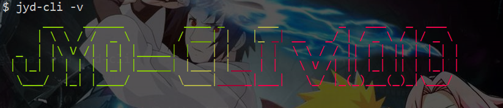
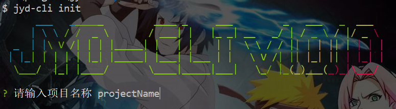
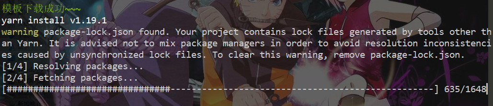

# jyd-cli

JYD内部cli

## 使用方法

### 下载

进行全局安装

```
npm install jyd-cli -g
```

或

```
yarn global add jyd-cli
```

安装完成后，可以通过查看版本号来确认是否安装成功

```
jyd-cli -v
```



### 创建项目

找好存放项目的文件夹，进行项目初始化

```
jyd-cli init
```

输入项目名称



选择项目架构

通过上下键选择是否使用BFF架构，即是否使用node中间层


根据项目需求，选择项目中是否使用高德地图


下载模板成功


下载模板成功后会自动执行安装依赖

